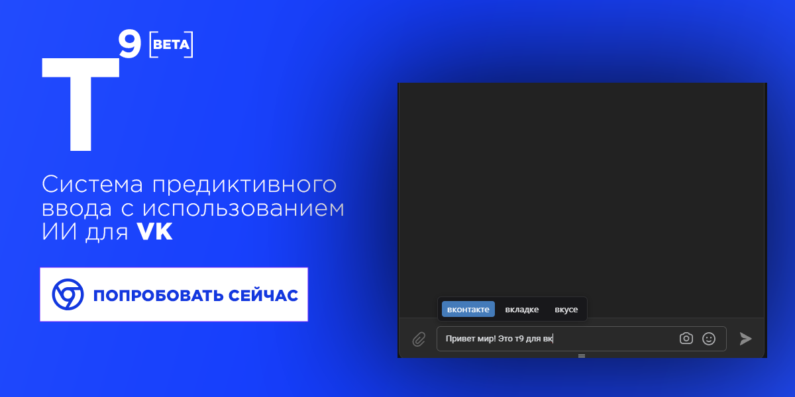

# VK T⁹ Extension

Расширение для браузера Chrome, добавляющее интеллектуальную систему предиктивного ввода текста для ВКонтакте с использованием AI.

## Особенности

- 🤖 Использует AI для генерации подсказок
- 📝 Поддерживает контекстно-зависимые подсказки
- 🎯 Учитывает грамматику русского языка
- ⚡ Кэширует часто используемые слова
- 🔄 Адаптируется под стиль письма пользователя

## Установка

1. Склонируйте репозиторий
2. Откройте Chrome и перейдите в `chrome://extensions/`
3. Включите "Режим разработчика"
4. Нажмите "Загрузить распакованное расширение"
5. Выберите папку с расширением

## Использование

1. Откройте диалог ВКонтакте
2. Начните вводить текст
3. Расширение будет предлагать варианты продолжения слов
4. Нажмите на подсказку или ALT для её принятия и Tab для переключения между подсказками

## Лицензия

MIT
